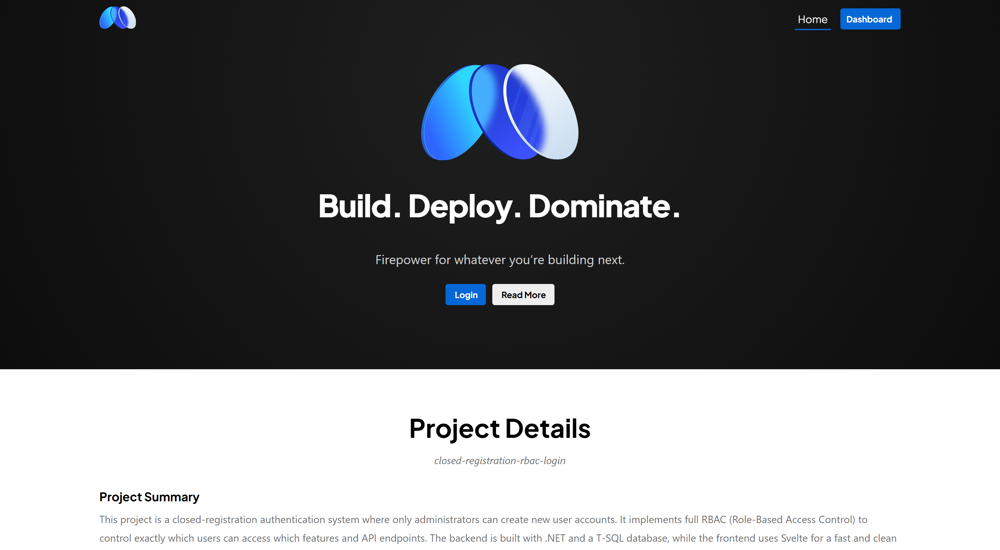
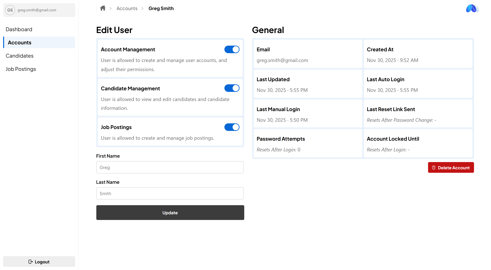
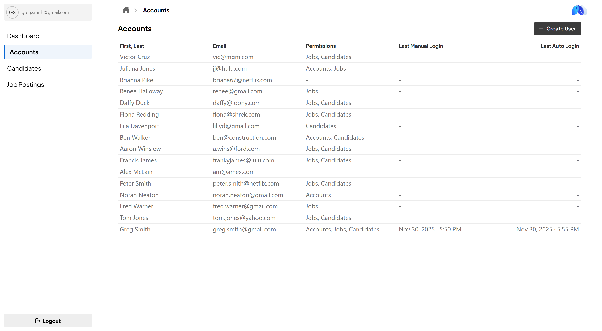
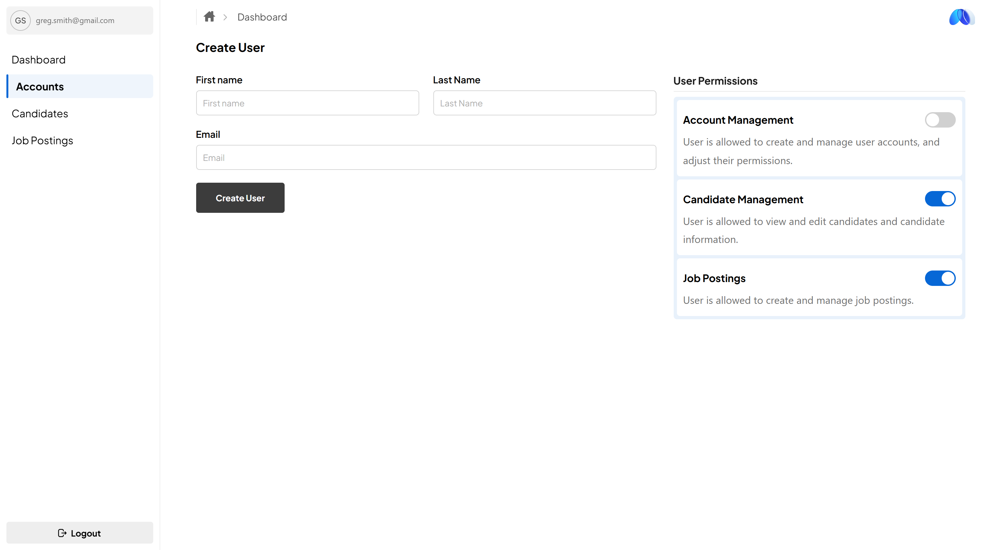

# Closed Registration RBAC Login System

This full stack project implements a closed-registration authentication system where only administrators can create user accounts. It uses a full RBAC (Role-Based Access Control) model to dictate exactly which users can access specific features, pages, and API endpoints.

The backend is powered by .NET and a SQL Server (T-SQL) database, handling authentication, refresh tokens, password hashing, and permission enforcement.
The frontend is built with Svelte, providing a fast, clean, reactive UI for both normal users and administrators.

Every protected route validates authentication tokens and permission scopes, ensuring users can only perform the actions they’ve been explicitly granted. Administrators can manage users, configure permissions, and oversee the system from a secure admin dashboard.

## Running Locally
**Frontend** - See the frontend instructions inside the /frontend folder’s README.

**Backend & Database Seed** - See the backend instructions and database seed setup in the /backend folder’s README.

## Project Photos

## Project Tech Stack
This project is built with a modern full-stack architecture using .NET on the backend, SvelteKit on the frontend, and Microsoft SQL Server for persistent storage.

### 🟦 Backend
- **.NET 10 (C#)**
- **ASP.NET Core Web API**
- **Dapper** 
- **Microsoft SQL Server** (T-SQL)

### 🟩 Frontend
- **SvelteKit**
- **TypeScript**

### 🗄️ Database
- **Microsoft SQL Server 2022**
- Schema + tables created in **T-SQL**